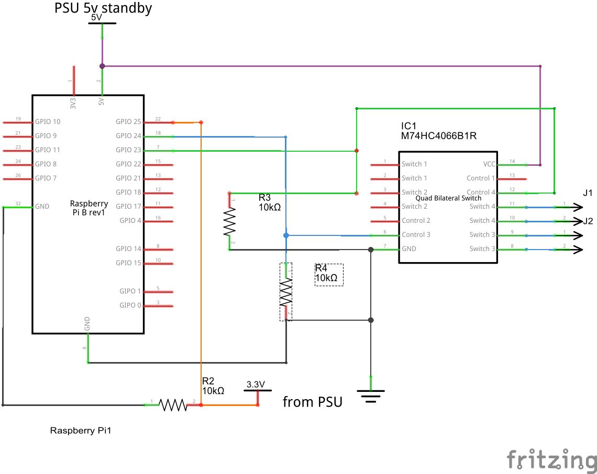

# fakewake

## Introduction

Fakewake is a software and hardware project that allows 
network remote control of a PC's power and reset buttons.

Wake-on-LAN allows remote start of a PC but has its limitations 
and does not provide a mechanism to shutdown or reboot the PC.
Fakewake provides a web and WOL interface that allows remote power on, 
power off, and reset. It also functions over WiFi which WOL does not.

## Hardware

The hardware needed for this project is fairly light consisting of a Raspberry Pi 
and a simple circuit to connect it to the PC's motherboard and PSU.

### Required

- Raspberry Pi (any model) with working network.
- 1 x M74HC4066B1R
- 3 x 10K ohm resistor
- wire, stripboard, etc as needed

### Recommended

- 24 pin ATX PSU extension cable
- 3 x "scotchlok" type connectors

### Circuit

### Connecting to PC

With mains power to the PC turned off and disconnected:

1. Connect J1 to Reset header. Reset Switch may be connected in parrallel.
2. Connect J2 to Power header. Reset Switch may be connected in parrallel.
3. Tap the 3.3v needed for PSU_SENSE from pin 1 of the PSU connector (usually Orange)
4. Tap ground from pin 3 of the PSU connector (usually black)
5. Tap 5v standby from pin 9 (usually Purple)

The taps from the PSU are most easily done using "scotchlok" type connectors. 
Using an ATX extension cable allows them to be made without damaging the PSU cable.

## Software

### Required

- raspbian Jessie (other OS may work but have not been tested)
- python 2
- gpiozero
- from this repository:
  - fakewake.py
  - default.cfg

### Installation

On the Raspberry Pi:

1. Copy and edit default.cfg to fit your requirements. See comments in 
default.cfg for details of configuration parameters.
2. Ensure fakewake.py has its permissions set to include executable.
3. If required, copy fakewake.py and your.cfg to where you want them to
run from.

No software is required on the target PC.

### Usage

To start the daemon with default configuration:

	/path/to/fakewake.py

With a custom configuration:

	/path/to/fakewake.py -c config_file.cfg

For help on command line options:

	/path/to/fakewake.py -h

Once the daemon is running, the target PC's power and reset buttons can be pressed
either via the web interface (ip.address.of.pi:port-in-config) or by sending a suitable
magic packet via udp broadcast to the configured port(s).

### Running at boot time

The simplest way to start the daemon at boot time is probably to add a line
similar to the one below to /etc/rc.local. Ensure it is added above the line that reads 
'exit 0'.

	/path/to/fakewake.py -c /path/to/config_file.cfg

## Hints & Tips

- Log files are written to `/tmp/fakewake.log` starting fresh when the daemon is started. 
The previous two log files are retained.
- Current log file can be viewed if the webserver is running by accessing <sever>/log
- Current configuration can be viewed if the webserver is running by accessing <sever>/config
- When started by root (or sudo) the daemon will switch to running as nobody:nogroup 
once all ports have been bound.
- Without a PSU_SENSE connection (the 3.3v tap) wake on LAN will not be available as
not knowing whether the PSU is on makes behaviour unpredictable.
- Wake on LAN magic packets must be sent as UDP broadcast packets to one or more of 
the configured ports. The daemon does not listen at a low enough level in the network stack 
to receive all ethernet frames.
- If you're not comfortable connecting 3.3v from the PC's PSU directly to the Pi's gpio, 
it should be possible to insert an optocoupler etc, so long as the gpio pin is pulled high 
while the PSU is fully on and low when the PSU is in standby, soft off, or off.
- Pi3 has not been tested. They should work, but check their current requirements 
do not exceed that provided by the 5v standby line of the PC's PSU.
- I've no idea whether this approach will work on a Mac as I don't have access to one.

## Disclaimer & License

This project is to be considered to be in "alpha". __Use entirely at your own risk__. It 
worked for me but your mileage may vary.

If you're not happy tinkering with the internals of a PC, and with soldering, this project 
may not be for you. A mistake in wiring the circuit and feeds from the PC to the Pi has 
the potential to damage any or all of the PC, its PSU, and the Pi. I can accept no 
responsibility for any damage that may occur.

This project is not currently released under any formal license. It is not in any way guaranteed, 
and has no promise of fitness for purpose.

Please do not distribute modified versions.

__Non-Commercial use only__
